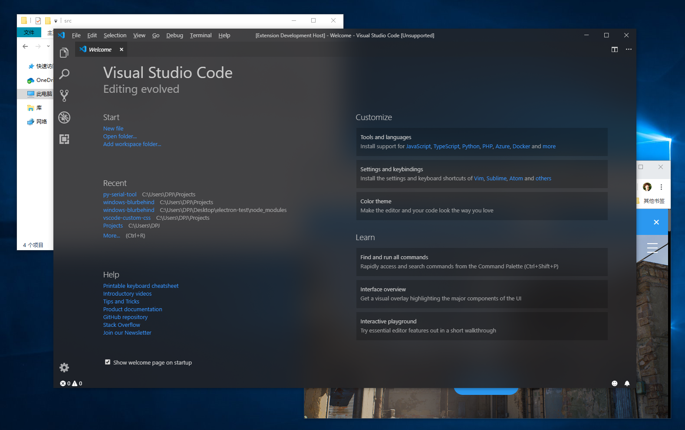
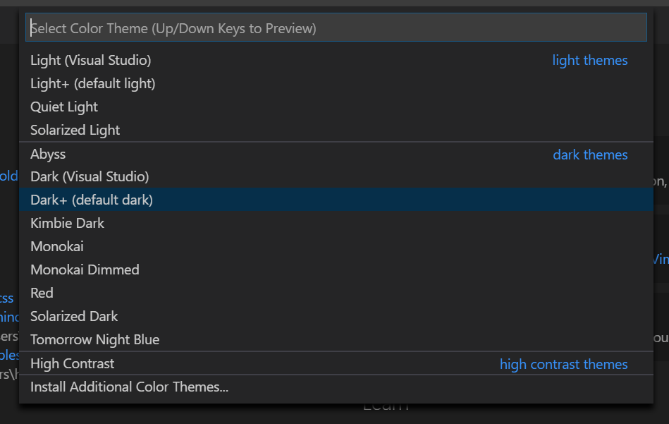
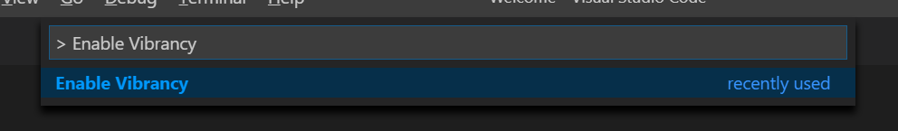
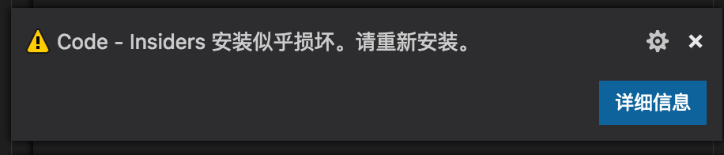
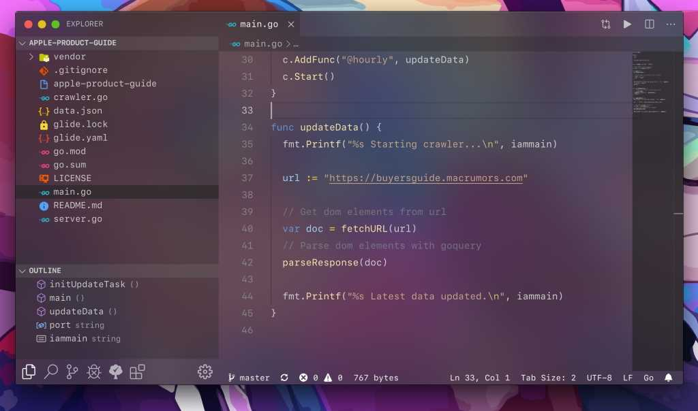
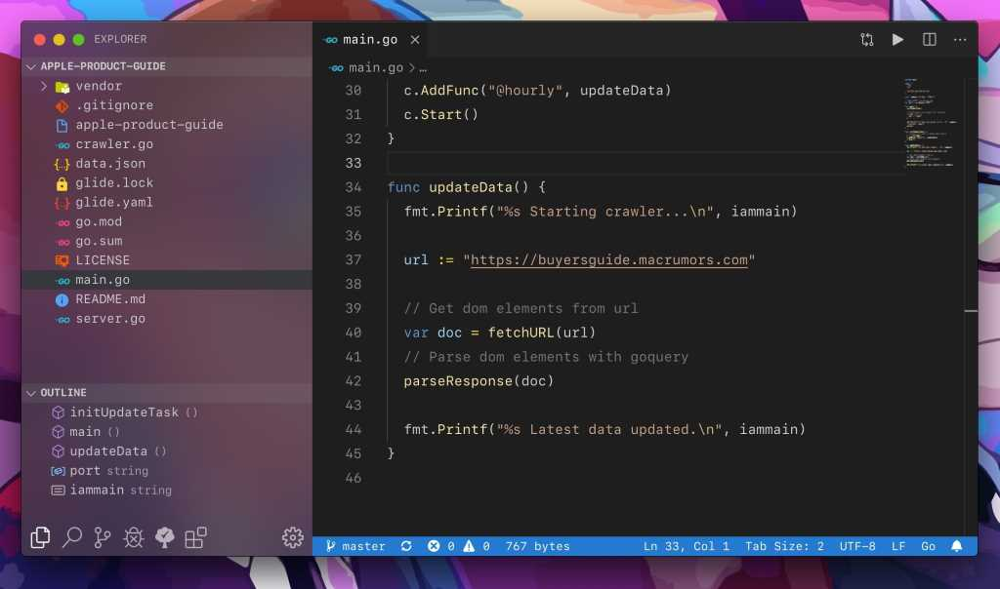

# Visual Studio Code Extension - Vibrancy

Enable Acrylic/Glass effect for your VS Code.

&nbsp;

&nbsp;

Links: [Github](https://github.com/eyhn/vscode-vibrancy) | [Visual Studio Code Marketplace](https://marketplace.visualstudio.com/items?itemName=eyhn.vscode-vibrancy) | [issues](https://github.com/eyhn/vscode-vibrancy/issues)

[中文教程 (Chinese README)](https://eyhn.in/vscode-vibrancy/)

## Supported Operating Systems

Windows 7 ✔

Windows 10 ✔

MacOS ✔

## Getting Started

1. Make sure the color theme you selected is the 'Dark+ (default)'

2. Install this extension from [the Visual Studio Code Marketplace](https://marketplace.visualstudio.com/items?itemName=eyhn.vscode-vibrancy).

3. Press F1 and Activate command "Reload Vibrancy".

4. Restart.

Every time after Code is updated, please re-enable vibrancy.

## Warning

This extension works by editting VS Code's css file. So, a prompt will appear when installing `vscode-vibrancy` for the first time or each time VS Code updates. U can click [never show again] to hide it.

To fix the "[Unsupported]" warning on VS Code's title bar, please refer to this extension: [Fix VSCode Checksums](https://marketplace.visualstudio.com/items?itemName=lehni.vscode-fix-checksums).

## Options

#### vscode_vibrancy.type

Native method of Vibrancy Effect.

* auto : Automatically switch with system version.
* dwm : (Windows 7 only) Windows Aero blur.
* acrylic : (Windows 10 only) Fluent Design blur.
* appearance-based, light, dark, titlebar, selection, menu, popover, sidebar, medium-light, ultra-dark: (MacOS only)

#### vscode_vibrancy.opacity

Opacity of Vibrancy Effect.

*value: 0.0 ~ 1*

#### vscode_vibrancy.theme

Select Vibrancy theme:

* Default Dark
* Dark (Only Subbar)

|        Default Dark      |    Dark (Only Subbar)   |
|:------------------------:|:-----------------------:|
|  |  | 

> You can contribute more themes for us! [see here](https://github.com/EYHN/vscode-vibrancy/tree/master/themes).

#### vscode_vibrancy.imports

Import CSS/JS files, as file paths.

EXAMPLE: `C:/Users/MyUserName/Documents/custom.css`

*value: array[]*

## FAQs

### How to uninstall?

Press F1 and Activate command "Disable Vibrancy", and Restart Visual Studio Code.

### Effect doesn't work for terminal?

Check your settings. You should change the renderer type of the terminal to dom.

`"terminal.integrated.rendererType": "dom"`

## Thanks ⭐

[be5invis/vscode-custom-css](https://github.com/be5invis/vscode-custom-css) : The basis of this extension program

[DIYgod](https://github.com/microsoft/vscode/issues/32257#issuecomment-509936623) : Fix issues with VSCode 1.36
